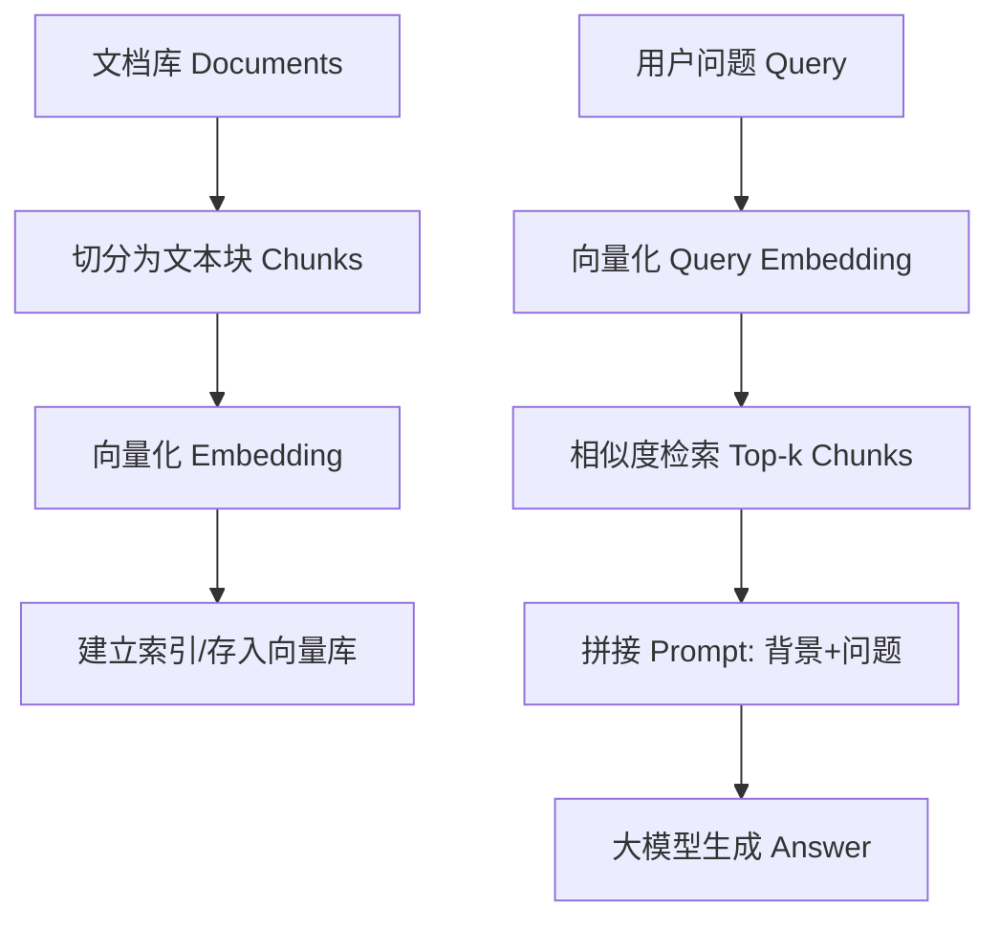
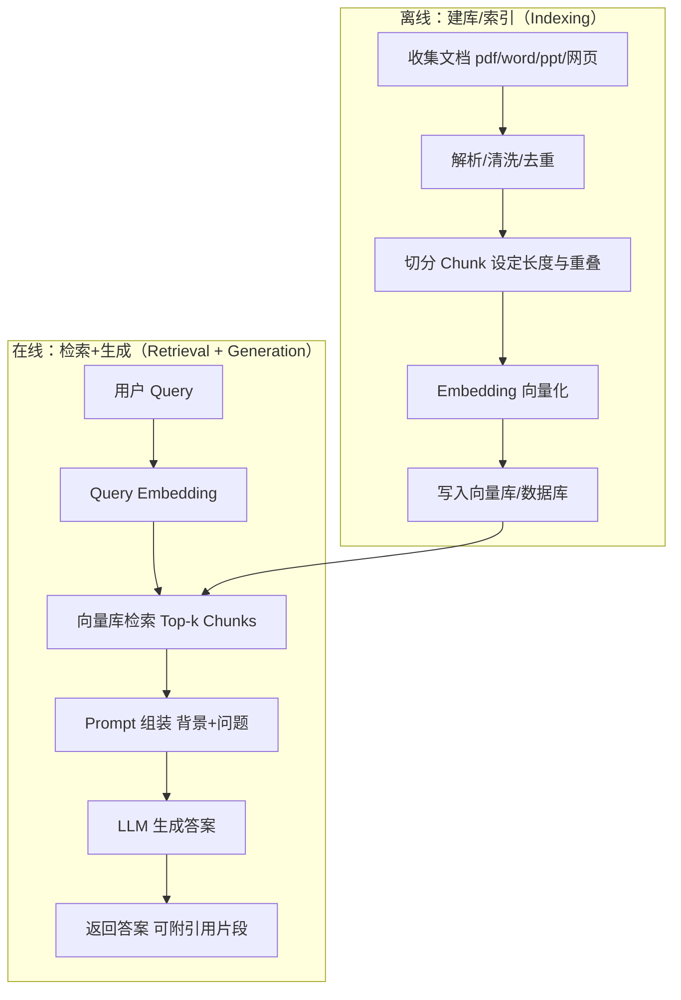
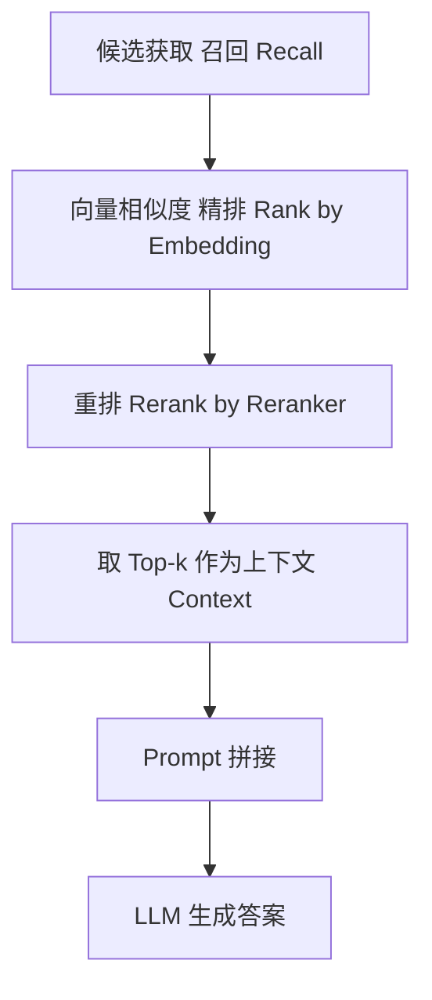
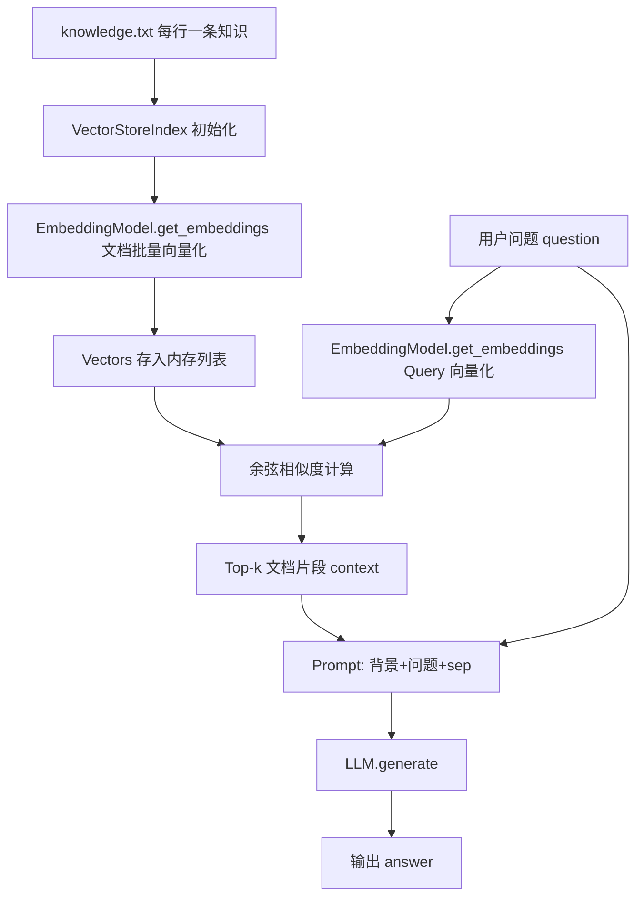
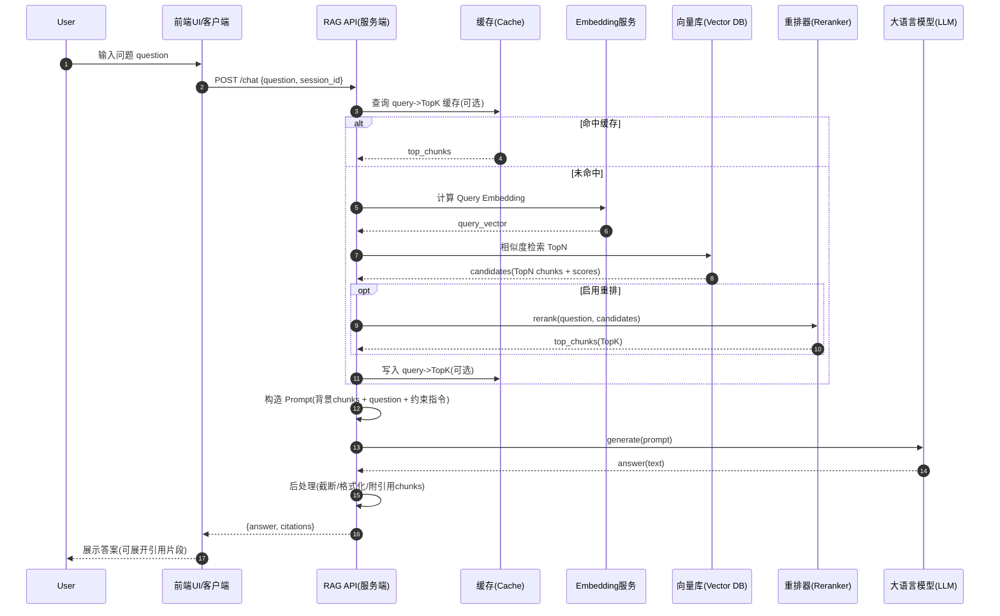

# RAG 学习手记

> 用“先检索、再让大模型写答案”的方式，把企业/私有知识接入大模型，降低幻觉、增强可控性与数据安全。

---

## 1. RAG 解决什么问题？

通用大模型在真实业务中常见三类问题：

- **知识局限**：模型训练数据里没有的（尤其是企业内部、实时更新的内容）它答不上来或答不准  
- **数据安全**：把企业资料拿去训练/上传外部服务风险很高  
- **幻觉**：模型可能“一本正经地胡说八道”，看起来合理但并不基于事实

**RAG（Retrieval Augmented Generation）**的核心思路是：

> 先从你的知识库里检索到相关资料（Chunks），再把这些资料作为“背景”交给大模型生成答案。
>
> 
>
> 

如下图所示，RAG通常包括以下三个基本步骤：

- 索引：将文档库分割成较短的 **Chunk** ，即文本块或文档片段，然后构建成向量索引。
- 检索：计算问题和 Chunks 的相似度，检索出若干个相关的 Chunk。
- 生成：将检索到的Chunks作为背景信息，生成问题的回答。

## 2. RAG 的三步：索引 → 检索 → 生成

**理解要点：**
- **索引（Indexing）**：把文档切成可检索的小块，并把每块转成向量保存  
- **检索（Retrieval）**：把问题也转成向量，去向量库里找最相关的若干块  
- **生成（Generation）**：把检索到的块当作背景，交给 LLM 生成回答

---

## 3. 工程化视角：离线流程 + 在线流程

RAG 通常拆成 **离线计算（建库）** + **在线计算（问答）**。

**为什么要离线？**  
全量文档向量化计算量大，离线做能显著降低在线延迟与成本；线上只做“问题向量化 + 检索 + 生成”。

---

## 4. 检索为什么常见“召回 / 精排 / 重排”？

当知识库变大时，会同时出现：
- **速度问题**：全库向量相似度计算越来越慢  
- **效果退化**：向量模型能力有限，Top1 相似度最高的块不一定最相关  

因此常见做法是分阶段检索：

**直觉总结：**
- 计算量：召回 > 精排 > 重排（具体实现会不同，但重排通常最贵、最慢）  
- 效果：召回 < 精排 < 重排（一般越往后越准）

---

## 5. “最小可跑通 RAG”代码在做什么？

教程用最少的类把 RAG 跑通：  
- `EmbeddingModel`：文本 → 向量  
- `VectorStoreIndex`：保存文档向量，并支持相似度查询（Top-k）  
- `LLM`：将“背景 + 问题”生成答案

### 5.1 组件与数据流

### 5.2 容易卡住的 3 个点

1) **为什么取 `[CLS]` 向量？**  
BERT 类 encoder 常用做法是在句首加 `[CLS]`，用它的最后一层隐藏向量代表整段文本语义（教程采用该方式）。

2) **为什么要 normalize？**  
把向量归一化到单位长度后，用余弦相似度比较“方向”更稳定，减少尺度差异带来的误差。

3) **为什么知识库太大要分 batch？**  
一次把全部文档丢到 GPU 做 embedding 可能爆显存；工程上需要分批向量化、并做缓存/增量更新。

---

## 6. 从“能跑通”到“能上线”的改造清单

建议把下面当作工程 checklist：

- **文档处理**：解析 → 清洗 → 去重 → 合理切块（chunk size + overlap）  
- **检索增强**：Top-k 调大（如 3~10）；必要时加召回与重排  
- **存储与性能**：用向量库/ANN（如 Milvus/Faiss/Annoy）；embedding 缓存；支持增量索引  
- **生成可控**：Prompt 明确“只基于背景回答；背景不足就说不知道”；返回引用片段便于验证  
- **评估与迭代**：用一组标准问题集做离线评测（命中率、答案准确率、引用一致性）

---

## 7. 常见排错顺序（RAG 答不对时先查这些）

1) 知识库里是否真的有答案？  
2) chunk 切分是否合理（太短/太长都会影响召回与生成）  
3) 文档向量与 query 向量是否同模型、同预处理？  
4) Top-k 是否太小？  
5) 是否需要 rerank（知识库大时经常是关键差异）

---

> 你可以直接把这份文档作为团队内部的 RAG 入门讲义；后续我也可以在此基础上继续补充：  
> - 适配 Typora 的“可复制 Prompt 模板”  
> - 一个更工程化的目录结构与代码骨架（支持批量 embedding、Top-k、多文档合并、可插拔 rerank、Milvus/Faiss 后端）

---

## 8. 在线问答时序图（Query → 检索 → 生成 → 返回）

下面是一张“线上一次问答请求”从前端到后端各组件的**时序图**。如果还没引入某些组件（如 Reranker / 缓存 / 引用返回），可以按需删减。

**读图提示：**
- **TopN vs TopK**：通常先检索 TopN（候选多一点），再通过重排/规则筛到 TopK（真正放进 Prompt）。  
- **缓存**：可以缓存“query → top_chunks”，降低重复问题的检索成本，也可缓存“chunk → embedding”。  
- **引用返回**：建议把使用到的 chunks（或其来源）一并返回，便于评估与纠错（也能减少“看起来像瞎编”的不信任感）。

