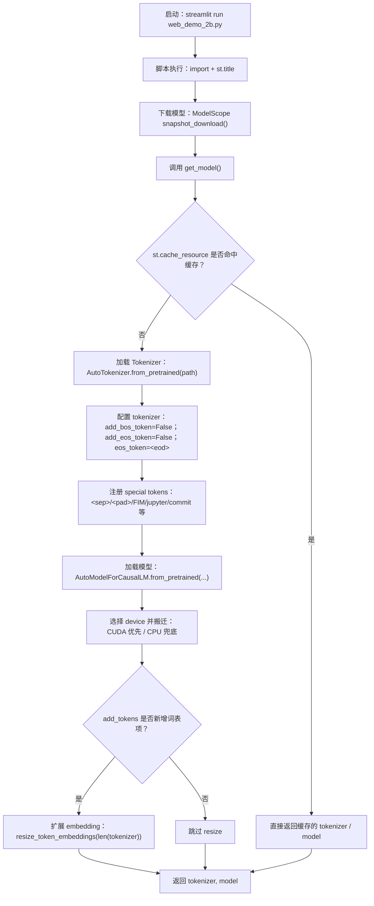
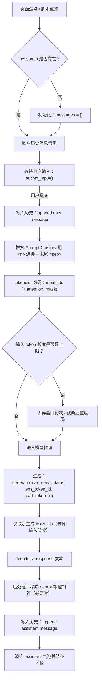

# Yuan2.0 智能编程助手技术文档

## 1. 项目概述

### 1.1 项目背景
随着软件开发和人工智能技术的发展，开发者们面临着日益复杂的编程挑战。传统的编程辅助工具往往只能提供基础的代码补全、错误提示等功能，难以理解开发者的整体意图或是上下文。

为了应对这一挑战，本项目利用最新的自然语言处理（NLP）技术，特别是 **浪潮源大模型 (Yuan2.0)**，开发了一款能够显著提升程序员工作效率的智能编程助手。

### 1.2 应用价值
* **提高开发效率**：减少重复工作和手动调试的时间，使开发者能更专注于业务逻辑和创新点。
* **降低学习成本**：帮助新手开发者更快地掌握新语言和技术栈。
* **增强代码质量**：辅助进行代码审查，确保代码遵循最佳实践。

---

## 2. 产品功能

本系统旨在为开发者提供全方位的编程辅助，主要功能包括：

1.  **智能代码生成**：根据用户自然语言描述，生成满足需求的代码片段。
2.  **多语言支持**：支持 Python, C++, Java, JavaScript 等主流编程语言。
3.  **代码理解和补全**：分析现有上下文，自动补全后续代码。
4.  **智能文档生成**：自动生成函数注释、模块说明文档。
5.  **代码优化建议**：识别低效代码并提供改进方案。

---

## 3. 技术方案与架构

### 3.1 方案架构
本项目采用 **Client-Server (C/S)** 架构模式（在本地部署演示中，前后端运行在同一环境中）。

* **服务端 (Model Backend)**：部署浪潮源 2.0 (Yuan2-2B) 大模型。负责加载模型权重、接收 Token 序列、执行推理计算并生成结果。
* **客户端 (Streamlit Frontend)**：基于 Python 的 Streamlit 框架开发 Web 交互界面。负责接收用户输入、维护对话历史 (Context)、将自然语言转换为模型可接受的 Prompt 格式，并将模型输出渲染展示。


### 3.2 数据流向

1.  **用户请求**：用户在 Streamlit 界面输入编程问题。
2.  **上下文拼接**：系统读取 Session State 中的历史对话，使用特定分隔符 `<n>` 进行拼接。
3.  **模型推理**：拼接后的 Prompt 输入到 Yuan2.0 模型，模型在 GPU 上进行计算生成。
4.  **结果返回**：模型输出的 Token 序列被解码为文本，并显示在前端。

---


### 3.3 代码逻辑处理流程图

> 说明：下列流程图使用 **Mermaid** 语法绘制。若你的 Markdown 阅读器不支持 Mermaid（例如部分本地预览器），可用支持 Mermaid 的平台（如 GitHub / Typora 新版本 / VSCode + Mermaid 插件）查看。

#### 3.3.1 启动与模型加载流程（含缓存与词表同步）



#### 3.3.2 单轮对话（一次输入→一次生成）的处理流程



#### 3.3.3 关键状态与数据在流程中的位置（便于调试）

- **`st.session_state.messages`**：对话“唯一事实来源”（source of truth）。页面每次重跑脚本时，通过它回放历史并继续拼接 prompt。
- **`<sep>`**：对话轮次/角色切分的“协议符号”。生成后常用它做截断或定位回答起点（更工程化的方式是只 decode 新生成 token）。
- **`<eod>`**：建议作为 **EOS（终止符）** 使用：既可用于生成停止（`eos_token_id`），也可用于展示前清理。
- **输入截断策略**：避免“历史越长越生成不出来”。推荐以 **token 数**（而不是字符数）为准做窗口截断。


## 4. 核心代码详细解析

以下是项目核心代码 `web_demo_2b.py` 的关键逻辑解释。

### 4.1 依赖导入与模型下载
利用 `modelscope` 解决大模型下载难、Git LFS 配置复杂的问题。

```python
from transformers import AutoTokenizer, AutoModelForCausalLM
import torch
import streamlit as st
from modelscope import snapshot_download

# 使用 ModelScope 自动下载模型到本地缓存目录
# snapshot_download 会自动处理断点续传和本地缓存
model_dir = snapshot_download('IEITYuan/Yuan2-2B-Mars-hf', cache_dir='./')
path = './IEITYuan/Yuan2-2B-Mars-hf'
```

### 4.2 模型加载函数（工程化推荐版）

本节在原 `get_model()` 基础上做了“工程级增强”，目标是 **更稳定、更通用、可排错**：

- ✅ 自动选择 `device`（有 GPU 用 GPU；否则 CPU 兜底），避免写死 `.cuda()`
- ✅ 自动选择推理 `dtype`（优先 `bfloat16`，不支持则 `float16`；CPU 用 `float32`）
- ✅ 兼容 Yuan2.0 的 SentencePiece：`use_fast=False`（避免 TikToken 解析报错）
- ✅ `tokenizer.add_tokens(...)` 后检查是否真的新增词表项；如新增则同步 `resize_token_embeddings`
- ✅ 设置 `pad_token` / `eos_token_id`，为 `generate()` 提供明确的停止与补齐策略
- ✅ `model.eval()` + `torch.inference_mode()`（推理更省显存、避免梯度开销）

> 说明：下面代码返回 `tokenizer, model, device`，后续推理统一使用 `device`，不要再直接 `.cuda()`。

```python
from typing import Tuple
import torch
import streamlit as st
from transformers import AutoTokenizer, AutoModelForCausalLM

# 约定的结构化 token
EOD_TOKEN = "<eod>"
SEP_TOKEN = "<sep>"
NL_TOKEN  = "<n>"

SPECIAL_TOKENS = [
    "<sep>", "<pad>", "<mask>", "<predict>",
    "<FIM_SUFFIX>", "<FIM_PREFIX>", "<FIM_MIDDLE>",
    "<commit_before>", "<commit_msg>", "<commit_after>",
    "<jupyter_start>", "<jupyter_text>", "<jupyter_code>",
    "<jupyter_output>", "<empty_output>",
]

def pick_device_and_dtype() -> Tuple[torch.device, torch.dtype]:
    \"\"\"根据运行环境选择 device 与 dtype。\"\"\"
    if torch.cuda.is_available():
        device = torch.device("cuda")
        # PyTorch 新版本提供 is_bf16_supported；旧版本用 getattr 兼容
        bf16_ok = getattr(torch.cuda, "is_bf16_supported", lambda: False)()
        dtype = torch.bfloat16 if bf16_ok else torch.float16
    else:
        device = torch.device("cpu")
        dtype = torch.float32
    return device, dtype

@st.cache_resource(show_spinner="Loading tokenizer & model...")
def get_model(model_path: str):
    device, dtype = pick_device_and_dtype()

    print("Create tokenizer...")
    tokenizer = AutoTokenizer.from_pretrained(
        model_path,
        add_eos_token=False,
        add_bos_token=False,
        eos_token=EOD_TOKEN,
        use_fast=False,              # Yuan2.0: SentencePiece 必须关 fast
        trust_remote_code=True,
    )

    # 1) 添加/声明特殊 token（可能会新增词表项）
    num_added = tokenizer.add_tokens(SPECIAL_TOKENS, special_tokens=True)

    # 2) 确保 pad_token 可用（批量推理/生成时需要 pad_token_id）
    if tokenizer.pad_token is None:
        if "<pad>" in tokenizer.get_vocab():
            tokenizer.pad_token = "<pad>"
        else:
            # 没有 <pad> 就退化用 eos 当 pad（不是最理想，但能跑）
            tokenizer.pad_token = tokenizer.eos_token

    print("Create model...")
    model = AutoModelForCausalLM.from_pretrained(
        model_path,
        torch_dtype=dtype,
        trust_remote_code=True,
    )

    # 3) 如果 tokenizer 真的新增了 token，必须同步扩展模型 embedding
    if num_added > 0:
        model.resize_token_embeddings(len(tokenizer))

    model.to(device)
    model.eval()
    print(f"Done. device={device}, dtype={dtype}, vocab={len(tokenizer)}")
    return tokenizer, model, device
```

### 4.3 交互与推理逻辑（工程化推荐版）

本节在原交互循环基础上增强 3 件事：

1. **Prompt 自动截断**：对话历史太长会挤占生成长度，必须限制输入 token 数（否则回答变短甚至不输出）。  
2. **用 `max_new_tokens` 代替 `max_length`**：`max_length` 是“输入+输出总长”，历史一长就没空间生成。  
3. **更稳的“截取回答”**：不再用 `split("<sep>")` 解析整段，而是只 decode “新生成部分”。

```python
from typing import List, Dict

def build_prompt_with_truncation(
    messages: List[Dict[str, str]],
    tokenizer,
    max_input_tokens: int = 1536,
    nl_token: str = NL_TOKEN,
    sep_token: str = SEP_TOKEN,
) -> str:
    \"\"\"只保留最近消息，确保输入 token 数不超过 max_input_tokens。\"\"\"
    kept: List[Dict[str, str]] = []
    for m in reversed(messages):
        kept.insert(0, m)
        candidate = nl_token.join(x["content"] for x in kept) + sep_token
        ids = tokenizer(candidate, return_tensors="pt", add_special_tokens=False)["input_ids"][0]
        if ids.numel() > max_input_tokens:
            kept.pop(0)  # 去掉最旧的一条
            break
    return nl_token.join(x["content"] for x in kept) + sep_token

def generate_reply(
    prompt_text: str,
    tokenizer,
    model,
    device,
    max_new_tokens: int = 512,
) -> str:
    enc = tokenizer(prompt_text, return_tensors="pt", add_special_tokens=False)
    input_ids = enc["input_ids"].to(device)
    attention_mask = enc.get("attention_mask", None)
    if attention_mask is not None:
        attention_mask = attention_mask.to(device)

    # 让 generate 明确知道：遇到 <eod> 就停；pad 用 pad_token_id
    eos_id = tokenizer.convert_tokens_to_ids(EOD_TOKEN) if EOD_TOKEN in tokenizer.get_vocab() else tokenizer.eos_token_id

    with torch.inference_mode():
        out = model.generate(
            input_ids=input_ids,
            attention_mask=attention_mask,
            do_sample=False,                 # 贪心：稳定可复现（适合编程/工具类）
            max_new_tokens=max_new_tokens,   # 只限制“新生成长度”
            eos_token_id=eos_id,
            pad_token_id=tokenizer.pad_token_id,
        )[0]

    # 只取“新生成部分”，避免 decode 整段 prompt
    gen_ids = out[input_ids.shape[1]:]
    text = tokenizer.decode(gen_ids, skip_special_tokens=False)

    # 做最小必要清理
    text = text.split(EOD_TOKEN)[0]
    text = text.replace(SEP_TOKEN, "")  # 防止模型意外吐出分隔符
    return text.strip()

# ---------------- Streamlit Chat Loop ----------------

# 初始化 session
if "messages" not in st.session_state:
    st.session_state["messages"] = []

# 回放历史
for msg in st.session_state.messages:
    st.chat_message(msg["role"]).write(msg["content"])

# 输入框
if user_text := st.chat_input():
    st.session_state.messages.append({"role": "user", "content": user_text})
    st.chat_message("user").write(user_text)

    with st.spinner("模型思考中..."):
        prompt_text = build_prompt_with_truncation(st.session_state.messages, tokenizer, max_input_tokens=1536)
        reply = generate_reply(prompt_text, tokenizer, model, device, max_new_tokens=512)

    st.session_state.messages.append({"role": "assistant", "content": reply})
    st.chat_message("assistant").write(reply)
```

#### 关键参数建议
- `max_input_tokens`：建议 1024~3072（取决于显存与模型上下文长度）；越大越“记得住历史”，但越慢  
- `max_new_tokens`：建议 256~1024（取决于你希望回答多长）  
- 编程/工具类任务：优先 `do_sample=False`；若想更“发散”，可启用采样（temperature/top_p）

## 5. 环境配置与部署指南

为了确保代码能够稳定运行，避免 `TikToken` 解析错误或 `AttributeError`，请严格按照以下步骤配置环境。

### 5.1 基础依赖安装
安装运行所需的 AI 框架、Web 框架及工具库。

```bash
pip install torch streamlit modelscope sentencepiece einops accelerate
```

### 5.2 关键版本锁定 (Troubleshooting)

**注意**：由于 Yuan2.0 模型代码与新版 Transformers 存在兼容性问题（主要涉及 KV Cache 和 Protobuf 解析），**必须**锁定以下版本：

1.  **降级 Transformers** (解决 `AttributeError: NoneType...shape`):
    ```bash
    pip install transformers==4.30.2
    ```

2.  **降级 Protobuf** (解决 `TypeError: Descriptors cannot be created directly`):
    ```bash
    pip install protobuf==3.20.0
    ```

### 5.3 启动服务

在终端执行以下命令：

```bash
streamlit run web_demo_2b.py
```

启动成功后，控制台将输出访问地址（通常为 `http://localhost:8501`），在浏览器中打开即可开始使用。

## 6. Demo展示

